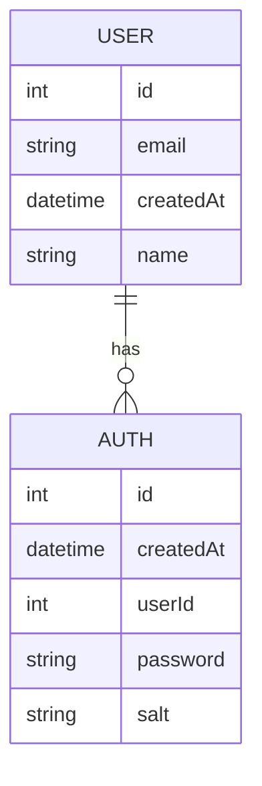

# Health Tracker

## Description

## Installation

```bash
$ pnpm install
```

## Running the app

```bash
# development
$ pnpm run start

# watch mode
$ pnpm run start:dev

# production mode
$ pnpm run start:prod
```

## Test

```bash
# unit tests
$ pnpm run test

# e2e tests
$ pnpm run test:e2e

# test coverage
$ pnpm run test:cov
```

## Diagrams



This diagram shows the relationship between the `User` and `Auth` models, where a `User` can have multiple `Auth` records.
